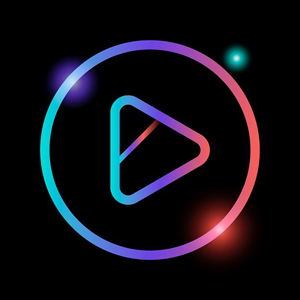
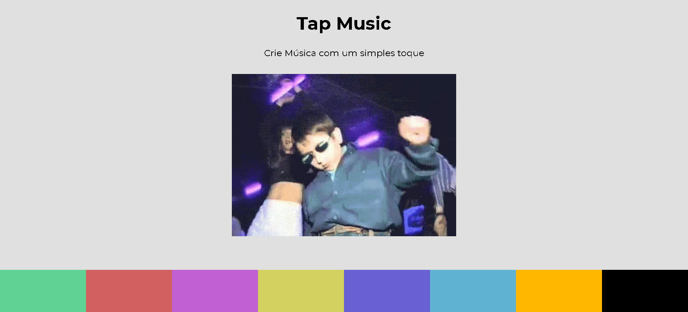

<h1 align="center">
    
</h1>

# Summary

- [Description](#📝-Description)
- [Project](#💻-Project)
- [Technologies](#🚀-Technologies)
- [Project Stats](#🎯-Project-Stats)

---

## 📝 Description

>💻 Tap Music is an app where you can click on the colors to make sounds at your own rithm, the project was created Dev ED in order to practice HTML, CSS and JavaScript.

---

## 💻 Project

* <b>Tap the colors</b>: To reproduce the sound you must touch the colors on the bottom of the page, which one will produce a singular sound.

<h1 align="center">
    
</h1>

---

## 🚀 Technologies
This project was developed with the following technologies:
* VS Code;
* HTML;
* CSS;
* JavaScript.

---

## 🎯 Project Stats

This project is currently finished.

---

## :heavy_check_mark: To do list

- Add Memes Versions
- Add More sounds
- Add More Backgrounds
- Make Possible to switch loadouts (Colors and songs)
- Make BackGround Full Screen

---

## :handshake: Become a Contributor

Do you have any ideas that you want to implement it? It's simple!

1. Fork the project
2. Modify what you think is necessary
3. Commit the changes
4. Create a Pull Request

---

## Author

- Projects - [Lucass2021](https://github.com/Lucass2021)

- Linkedin - [@Lucas Dias da Silva](https://www.linkedin.com/in/lucas-dias-da-silva-118954199/)

- Email - [Lucas Dias](mailto:lucas.allx@hotmail.com")
